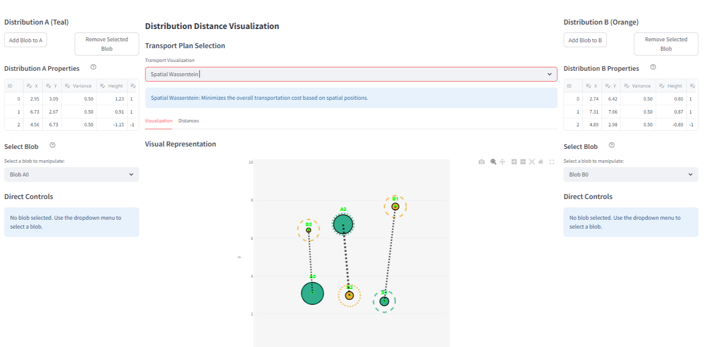

# Distribution Distance Visualization

An interactive educational visualization platform for exploring distance metrics between mathematical distributions through dynamic, engaging 2D probability simulations.



> DISCLAIMER: This app was vibe-coded using Repl.it in order to try out its code generation features. If you are using it to help you learn about optimal transportation... don't - before you check that the computation is performed correctly. Caveat emptor.

## Overview

This application allows users to:

- Create and manipulate Gaussian distributions in a 2D space
- Adjust blob positions, heights (including negative values), and variances
- Visualize transport plans between distributions
- Calculate and compare different distance metrics:
  - Spatial Bottleneck Distance
  - Spatial Wasserstein Distance
  - Height-Based Bottleneck Distance
  - Height-Based Wasserstein Distance

## Features

- **Interactive Distribution Creation**: Add, remove, and modify Gaussian blobs with intuitive controls
- **Real-time Visualization**: See immediate updates to distances and transport plans as distributions change
- **Contour Plot Visualization**: Toggle contour plots for distributions with adjustable opacity
- **Distance Matrices**: View detailed distance matrices showing pairwise blob distances
- **Multiple Distance Metrics**: Compare different ways of measuring distribution distances
- **Sign-Based Visualization**: Dashed circles for positive heights, dotted for negative heights
- **Import/Export**: Save and load distribution configurations for reproducibility, and export focused reports containing only the selected transport plan

## Documentation

This repository includes several documentation files:

- [Deployment Guide](DEPLOYMENT.md): How to install and run the application on your local machine
- [Developer Guide](DEVELOPER.md): Technical documentation for developers working with the codebase
- [Math Validation Guide](MATH_VALIDATION.md): Guide for validating the mathematical calculations
- [Math Developer Guide](MATH_DEVELOPER.md): Documentation for extending the application with new distance metrics

## Technical Details

The application is built with:

- **Python**: Core programming language
- **Streamlit**: Web application framework for interactive UI
- **Plotly**: Advanced data visualization library
- **NumPy/SciPy**: Scientific computing libraries for mathematical operations
- **Pandas**: Data manipulation and analysis

The architecture follows the Model-View-Controller (MVC) pattern:

- **Models**: Define the data structures (blobs, distributions)
- **Views**: Handle UI components and visualizations
- **Controllers**: Implement business logic and calculations

## Getting Started

See the [Deployment Guide](DEPLOYMENT.md) for detailed installation instructions.

```bash
# Quick start
git clone <repository-url>
cd <repository-directory>
pip install -r requirements.txt
streamlit run app.py
```

## Educational Value

This application serves as an educational tool for:

- Understanding optimal transport theory
- Visualizing distribution distances
- Exploring different metrics for comparing distributions
- Interactive learning of transportation problems

## License

[MIT License](LICENSE)

## Acknowledgments

- Inspired by research in optimal transport theory
- Built with Streamlit's interactive framework
- Mathematical components powered by SciPy and NumPy
